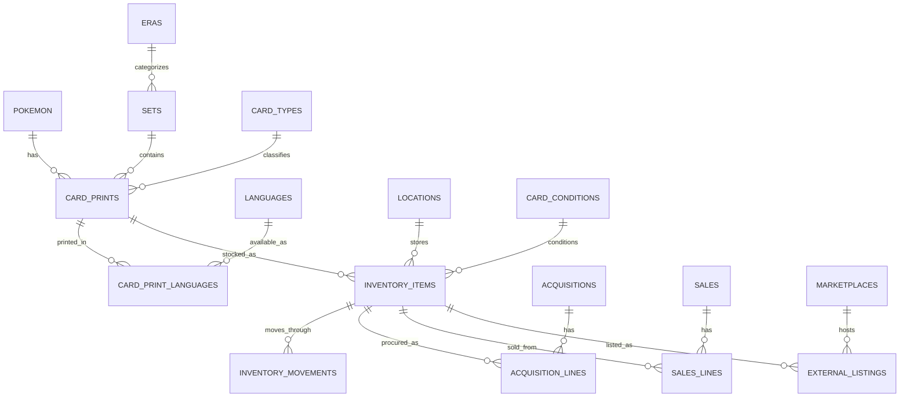

# 💤 Snoredex

## 📘 Project Overview

Snoredex is a normalized PostgreSQL schema for tracking Snorlax TCG prints, inventory, procurement/sales activity, and marketplace listings.

The schema is designed for:

- Collection tracking
- Inventory movement ledgering
- Procurement and sales profitability reporting
- Marketplace synchronization
- Multilingual release tracking

Marketplace support is normalized via:

- `marketplaces` (Cardmarket, eBay, TCGPlayer, etc.)
- `external_listings` linked to inventory items
- `cardmarket_listings` compatibility view for legacy reads

## 🗺 Database ER Diagram

