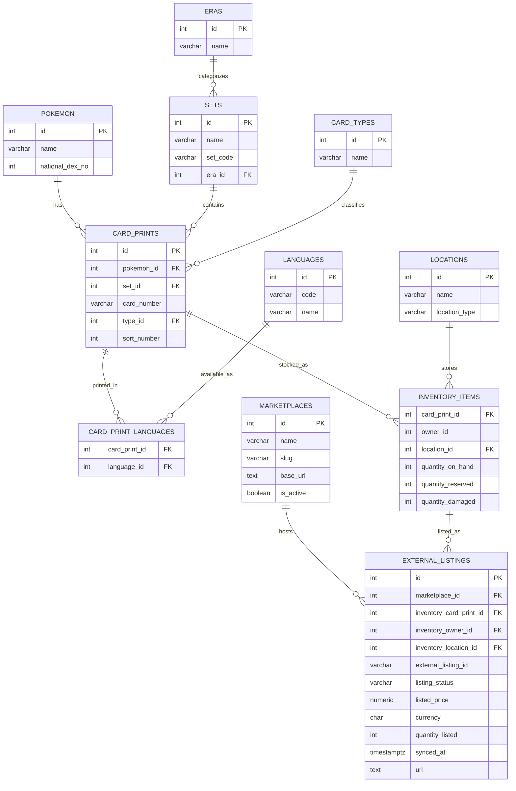

# Snoredex ER Diagram

```mermaid
erDiagram

    POKEMON {
        int id PK
        varchar name
        int national_dex_no
    }

    ERAS {
        int id PK
        varchar name
    }

    SETS {
        int id PK
        varchar name
        varchar set_code
        int era_id FK
    }

    CARD_TYPES {
        int id PK
        varchar name
    }

    CARD_PRINTS {
        int id PK
        int pokemon_id FK
        int set_id FK
        varchar card_number
        int type_id FK
        int sort_number
    }

    LANGUAGES {
        int id PK
        varchar code
        varchar name
    }

    CARD_PRINT_LANGUAGES {
        int card_print_id FK
        int language_id FK
    }

    LOCATIONS {
        int id PK
        varchar name
        varchar location_type
    }

    INVENTORY_ITEMS {
        int card_print_id FK
        int owner_id
        int location_id FK
        int quantity_on_hand
        int quantity_reserved
        int quantity_damaged
    }

    MARKETPLACES {
        int id PK
        varchar name
        varchar slug
        text base_url
        boolean is_active
    }

    EXTERNAL_LISTINGS {
        int id PK
        int marketplace_id FK
        int inventory_card_print_id FK
        int inventory_owner_id FK
        int inventory_location_id FK
        varchar external_listing_id
        varchar listing_status
        numeric listed_price
        char currency
        int quantity_listed
        timestamptz synced_at
        text url
    }

    POKEMON ||--o{ CARD_PRINTS : has
    SETS ||--o{ CARD_PRINTS : contains
    ERAS ||--o{ SETS : categorizes
    CARD_TYPES ||--o{ CARD_PRINTS : classifies
    CARD_PRINTS ||--o{ CARD_PRINT_LANGUAGES : printed_in
    LANGUAGES ||--o{ CARD_PRINT_LANGUAGES : available_as
    CARD_PRINTS ||--o{ INVENTORY_ITEMS : stocked_as
    LOCATIONS ||--o{ INVENTORY_ITEMS : stores
    MARKETPLACES ||--o{ EXTERNAL_LISTINGS : hosts
    INVENTORY_ITEMS ||--o{ EXTERNAL_LISTINGS : listed_as
```
