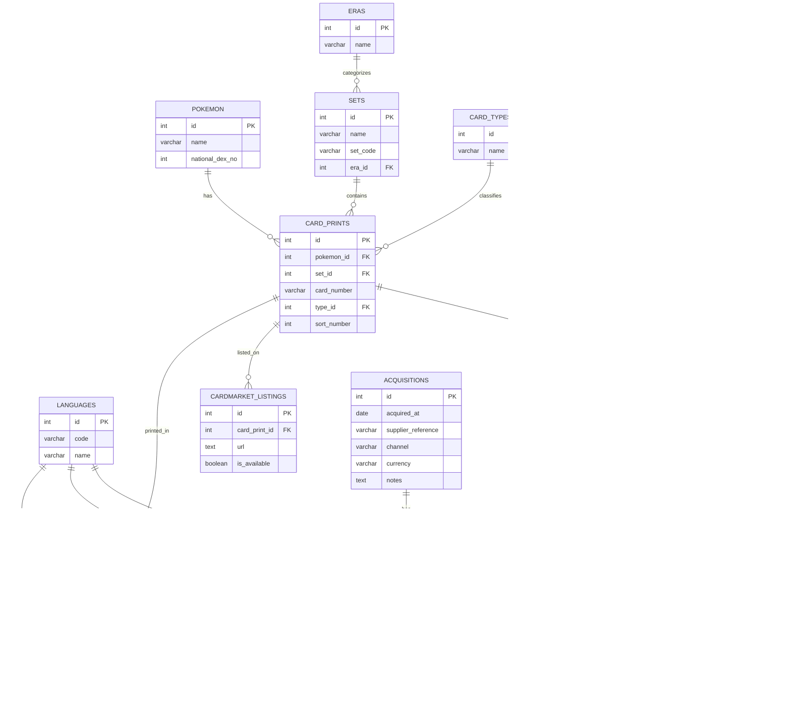

# Snoredex ER Diagram

```mermaid
erDiagram

    POKEMON {
        int id PK
        varchar name
        int national_dex_no
    }

    ERAS {
        int id PK
        varchar name
    }

    SETS {
        int id PK
        varchar name
        varchar set_code
        int era_id FK
    }

    CARD_TYPES {
        int id PK
        varchar name
    }

    CARD_PRINTS {
        int id PK
        int pokemon_id FK
        int set_id FK
        varchar card_number
        int type_id FK
        int sort_number
    }

    LANGUAGES {
        int id PK
        varchar code
        varchar name
    }

    CARD_PRINT_LANGUAGES {
        int card_print_id FK
        int language_id FK
    }

    CARDMARKET_LISTINGS {
        int id PK
        int card_print_id FK
        text url
        boolean is_available
    }

    LOCATIONS {
        int id PK
        varchar name
        varchar location_type
    }

    INVENTORY_ITEMS {
        int card_print_id FK
        int owner_id
        int location_id FK
        int quantity_on_hand
        int quantity_reserved
        int quantity_damaged
    }


    ACQUISITIONS {
        int id PK
        date acquired_at
        varchar supplier_reference
        varchar channel
        varchar currency
        text notes
    }

    ACQUISITION_LINES {
        int id PK
        int acquisition_id FK
        int card_print_id FK
        int owner_id
        int location_id
        int language_id FK
        int quantity
        numeric unit_cost
        numeric fees
        numeric shipping
    }

    SALES {
        int id PK
        date sold_at
        varchar buyer_reference
        varchar channel
        varchar currency
        text notes
    }

    SALES_LINES {
        int id PK
        int sale_id FK
        int card_print_id FK
        int owner_id
        int location_id
        int language_id FK
        int quantity
        numeric unit_sale_price
        numeric fees
        numeric shipping
    }

    POKEMON ||--o{ CARD_PRINTS : has
    SETS ||--o{ CARD_PRINTS : contains
    ERAS ||--o{ SETS : categorizes
    CARD_TYPES ||--o{ CARD_PRINTS : classifies
    CARD_PRINTS ||--o{ CARD_PRINT_LANGUAGES : printed_in
    LANGUAGES ||--o{ CARD_PRINT_LANGUAGES : available_as
    CARD_PRINTS ||--o{ CARDMARKET_LISTINGS : listed_on
    CARD_PRINTS ||--o{ INVENTORY_ITEMS : stocked_as
    LOCATIONS ||--o{ INVENTORY_ITEMS : stores
    ACQUISITIONS ||--o{ ACQUISITION_LINES : has
    SALES ||--o{ SALES_LINES : has
    INVENTORY_ITEMS ||--o{ ACQUISITION_LINES : procured_as
    INVENTORY_ITEMS ||--o{ SALES_LINES : sold_from
    LANGUAGES ||--o{ ACQUISITION_LINES : acquired_language
    LANGUAGES ||--o{ SALES_LINES : sold_language
```
